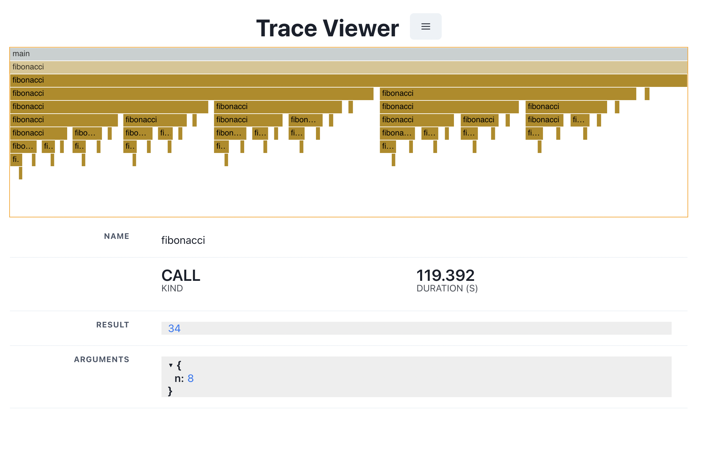

# LLMTracer

[](https://twitter.com/intent/follow?screen_name=blackhc)
[](https://pypi.org/project/llmtracer/)
[](https://pypi.org/project/llmtracer/)
[](https://github.com/blackhc/llmtracer/actions/workflows/dev.yml)
[](https://codecov.io/github/blackhc/llmtracer)


A simple (opinionated) library to trace calls to an LLM model (and more) with some batteries included:

* simple `@trace_calls` decorator;
* FlameCharts;
* [Pynecone](https://pynecone.io/) web app (local) to stream the output to a web browser at runtime and/or explore saved JSON files
* JSON output;
* interactive SVG output;
* [WandB](https://wandb.ai/) integration (public example [here](https://wandb.ai/oatml-andreas-kirsch/llmtracer/runs/6mhws049));

The big difference to just using [WandB](https://wandb.ai/) is that the app supports live-streaming while WandB waits for the full calls to finish before making them available. Useful for the impatient among us.

## Motivation

[WandB](https://wandb.ai/) only supports showing finished traces but I wanted to be able to view them in real-time (at finer granularity).

Further, I want to make it easier to explore nested and complex calls and display properties of the calls.

## Installation

### Node.JS

To be able to run the web app, first, make sure you have Node.js installed. You can use `conda` to install Node.js as follows:

```
conda install -c conda-forge nodejs
```

Or, to install a specific version of Node.js (this one worked for me on my MacBook---so this will not work on Linux):

```
conda install -c conda-forge nodejs=18.15.0=h26a3f6d_0
```

### LLMTracer & race Viewer

Once Node.js is installed, you can install LLMTracer using `pip`  (if you have nodejs available in your base environment):

```
pip install llmtracer
```

To run the trace viewer which can load both saved JSON traces and live-streamed traces, run:

```
llmtraceviewer
```

### Usage:

A simple example:

```python
from time import sleep

import wandb

from llmtracer import (
    JsonFileWriter,
    TraceViewerIntegration,
    trace_calls,
    wandb_tracer,
)
from llmtracer.handlers.svg_writer import SvgFileWriter


@trace_calls(capture_args=True, capture_return=True)
def add_values(a: int, b: int):
    # sleep 1 second
    sleep(1)

    return a + b


@trace_calls(capture_args=True, capture_return=True)
def fibonacci(n: int):
    if n <= 1:
        return 1
    return add_values(fibonacci(n - 1), fibonacci(n - 2))


wandb.init(project="llmtracer", name="simple_example")

event_handlers = [
    JsonFileWriter("simple_example.json"),
    SvgFileWriter("simple_example.svg"),
    TraceViewerIntegration(),
]

with wandb_tracer(
    "main", stack_frame_context=0, event_handlers=event_handlers
) as trace_builder:
    print(fibonacci(10))
```

## Screenshots



https://github.com/BlackHC/llmtracer/assets/729312/c77faa7d-a831-496c-b791-8822577391e5

[](https://wandb.ai/oatml-andreas-kirsch/llmtracer/runs/6mhws049)

[SVG Example](./example/simple_example.svg)

[JSON Example](./example/simple_example.json)

## Documentation

* License: LGPL-3.0
* Source Code: <https://github.com/blackhc/llmtracer>
* PyPI Package: <https://pypi.org/project/llmtracer/>
* Official Documentation: <https://blackhc.github.io/llmtracer>

## Contributing

Bug fixes, feature requests, and pull requests are welcome! If you have any questions or suggestions, please open an issue on GitHub.

## License

LLMTracer is licensed under AGPL3.0. If you require a commercial license for any part of the project, please contact the author.

## Credits

This package was created using [PyneCone](https://pynecone.io/) with [Cookiecutter](https://github.com/audreyr/cookiecutter) and the [waynerv/cookiecutter-pypackage](https://github.com/waynerv/cookiecutter-pypackage) project template.
